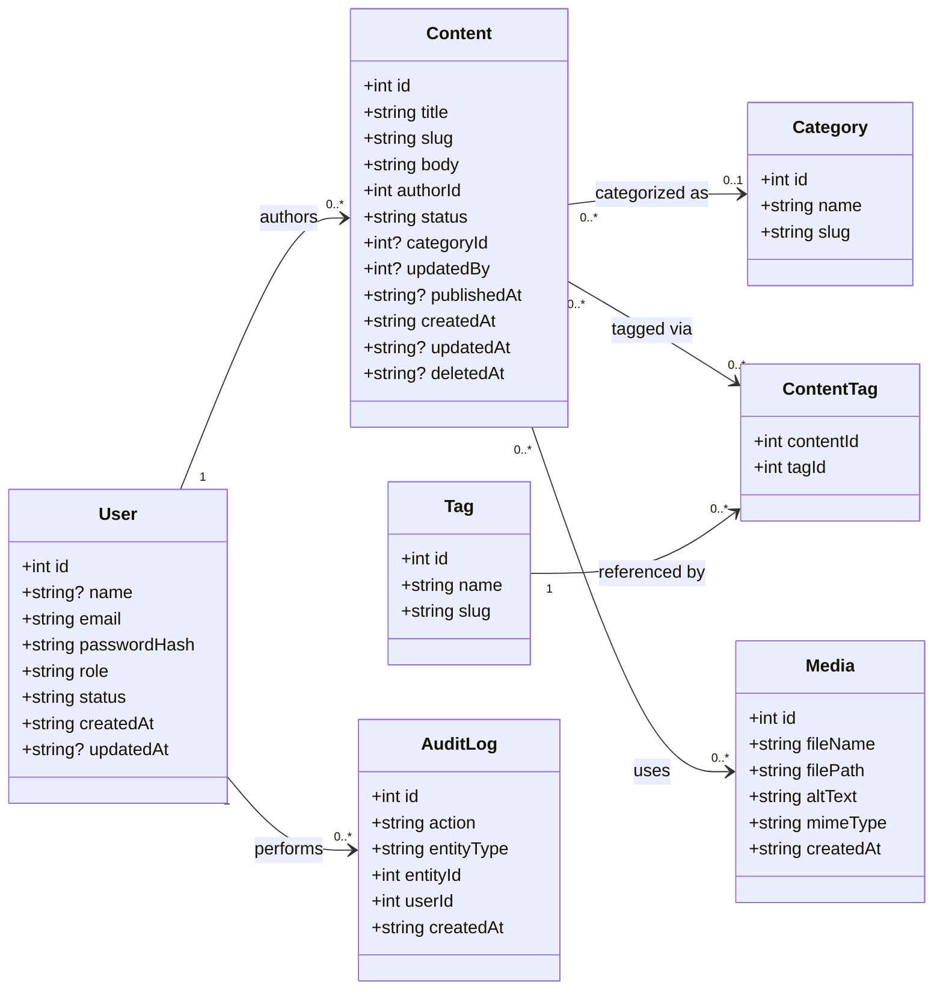
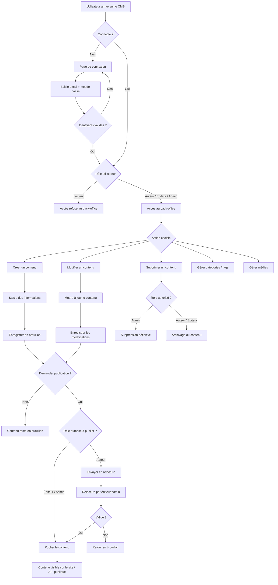

# HeadCore CMS

CMS headless PHP maison — back-office + API publique JSON.

---

## Lancer le projet en local

### Prérequis

- [Docker](https://www.docker.com/) et Docker Compose installés

### 1. Configurer les variables d'environnement

Créer un fichier `.env` à la racine du projet :

```env
POSTGRES_DB=headcore
POSTGRES_USER=headcore
POSTGRES_PASSWORD=secret
POSTGRES_HOST=headcore-db-postgre
POSTGRES_PORT=5432
```

### 2. Démarrer les services

```bash
docker-compose up --build -d
```

| Service | URL |
|---|---|
| Backend PHP | http://localhost |
| Adminer (DB UI) | http://localhost:8080 |

Connexion Adminer : sélectionner **PostgreSQL**, serveur `headcore-db-postgre`, credentials du `.env`.

### 3. Arrêter les services

```bash
docker-compose down          # arrêter
docker-compose down -v       # arrêter + supprimer les données
```

---

## Choix techniques

### Images Docker

| Service | Image | Raison |
|---|---|---|
| Backend | `php:8.4-apache` | Dernière version stable PHP avec Apache intégré, `mod_rewrite` pour le front controller |
| Base de données | `postgres:18` | Version imposée par le cahier des charges |
| Adminer | `adminer:4` | Interface légère pour administrer PostgreSQL |
| Frontend | `node:20-alpine` | LTS, image Alpine pour minimiser la taille |

---

## Structure du projet

```
/app        → fonctionnalités CMS (Controllers, Entities, Repositories, Services)
/core       → framework PHP maison (Router, ORM, Http, Database…)
/public     → front controller — index.php reçoit toutes les requêtes et les dispatche
/resources  → SCSS et JS pour le front du back-office
/bruno      → collection Bruno pour tester l'API
/doc        → diagrammes UML et flux
```

---

## Architecture

Toutes les requêtes passent par `public/index.php` (front controller), qui bootstrappe le framework `/core` et dispatche vers `/app`.

Chaque fonctionnalité suit une architecture en couches stricte :

| Couche | Dossier | Rôle |
|---|---|---|
| Controller | `app/Controllers/` | Orchestration HTTP — parse la requête, appelle le service, retourne une réponse |
| Service | `app/Services/` | Logique métier — validation, règles, coordination |
| Repository | `app/Repositories/` | Accès BDD uniquement — étend `AbstractRepository` |
| Entity | `app/Entities/` | Structure de données — annotations ORM, getters/setters |

---

## Rôles et permissions

| Rôle | Responsabilité |
|---|---|
| `admin` | Gestion complète (utilisateurs, configuration, tout) |
| `editor` | Publie et archive le contenu des autres |
| `author` | Crée et gère son propre contenu |
| `reader` | Lecture seule — rôle par défaut à l'inscription |

### Permissions

| Permission | Admin | Editor | Author | Reader |
|---|:---:|:---:|:---:|:---:|
| content.read | ✅ | ✅ | ✅ | ✅ |
| content.create | ✅ | ✅ | ✅ | ❌ |
| content.edit.own | ✅ | ✅ | ✅ | ❌ |
| content.edit.any | ✅ | ✅ | ❌ | ❌ |
| content.publish | ✅ | ✅ | ❌ | ❌ |
| content.archive | ✅ | ✅ | ❌ | ❌ |
| content.delete | ✅ | ❌ | ❌ | ❌ |
| content.restore | ✅ | ❌ | ❌ | ❌ |
| tag.create | ✅ | ✅ | ✅ | ❌ |
| taxonomy.manage | ✅ | ✅ | ❌ | ❌ |
| media.upload | ✅ | ✅ | ✅ | ❌ |
| media.delete | ✅ | ✅ | ❌ | ❌ |
| user.manage | ✅ | ❌ | ❌ | ❌ |
| settings.manage | ✅ | ❌ | ❌ | ❌ |

### Taxonomies

| Action | Author | Editor | Admin |
|---|:---:|:---:|:---:|
| Créer un tag | ✅ | ✅ | ✅ |
| Supprimer un tag | ❌ | ✅ | ✅ |
| Créer une catégorie | ❌ | ✅ | ✅ |
| Supprimer une catégorie | ❌ | ✅ | ✅ |

---

## Workflow de publication

```
draft → review → published → archived
                    ↑
         archived → draft (admin uniquement)
```

| Statut | Visible publiquement | Description |
|---|:---:|---|
| `draft` | ❌ | En cours d'écriture, modifiable librement par l'auteur |
| `review` | ❌ | Soumis pour validation, en attente d'un éditeur/admin |
| `published` | ✅ | Version officielle, visible sur le site et l'API |
| `archived` | ❌ | Retiré de la publication, conservé pour historique |

### Suppression

| Action | Qui | Résultat |
|---|---|---|
| Soft delete | Editor, Author | `deleted_at = now()` — invisible mais récupérable |
| Hard delete | Admin uniquement | Supprimé définitivement de la base |

---

## Diagrammes

### Modèle de données (UML)



### Flux de publication

