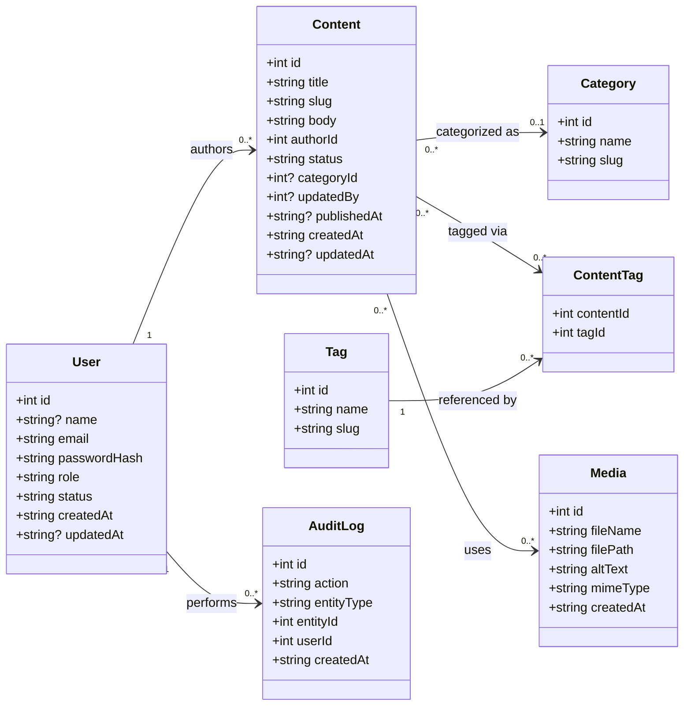
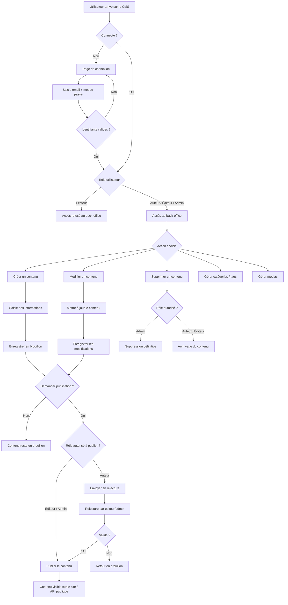

# HeadCore CMS

## Lancer le projet en local

### Prérequis
- [Docker](https://www.docker.com/) et Docker Compose installés

### 1. Configurer les variables d'environnement

Copier le texte ci-dessous dans un fichier `.env` à la racine du projet :

```env
POSTGRES_DB=headcore
POSTGRES_USER=headcore
POSTGRES_PASSWORD=secret
POSTGRES_HOST=headcore-db-postgre
POSTGRES_PORT=5432
```

### 2. Démarrer les services

```bash
docker-compose up --build -d
```

| Service | URL |
|---|---|
| Backend PHP | http://localhost:80 |
| Adminer (DB UI) | http://localhost:8080 |

Pour se connecter à Adminer : sélectionner **PostgreSQL**, serveur `headcore-db-postgre`, avec les credentials du `.env`.

### 3. Arrêter les services

```bash
docker-compose down
```

Pour supprimer aussi les données de la base :

```bash
docker-compose down -v
```

---

## Choix techniques

### Images Docker

| Service | Image | Raison |
|---|---|---|
| Backend | `php:8.4-apache` | Dernière version stable PHP avec Apache intégré, `mod_rewrite` pour le front controller |
| Base de données | `postgres:18` | Version imposée par le cahier des charges |
| Adminer | `adminer:4` | Interface légère pour administrer PostgreSQL |
| Frontend | `node:20-alpine` | LTS, image Alpine pour minimiser la taille |

---

## Structure du projet

```
/app        → fonctionnalités CMS (Controllers, Entities, Repositories, Services)
/core       → framework PHP maison (Router, ORM, Http, Database…)
/public     → front controller, point d'entrée unique (index.php),  il reçoit toutes les requêtes et les dispatche au bon endroit.
/resources  → SCSS et JS pour le front du back office
/doc        → diagrammes UML et flux
```

## Diagrammes
| Rôle | Responsabilité typique |                                                                                                                              
|------|----------------------|                                                                                                                              
| `admin` | Gestion complète (users, config, tout) |                                                                                                           
| `editor` | Publie/archive le contenu des autres |                                                                                                            
| `author` | Crée et gère son propre contenu |                                                                                                                 
| `reader` | Lecture seule (rôle par défaut à l'inscription) |

UML

Diagramme de flux


# Rôles et permissions
| Permission        | Admin | Editor | Author | Reader |
|------------------|:-----:|:------:|:------:|:------:|
| content.read     |  ✅   |   ✅   |   ✅   |   ✅   |
| content.create   |  ✅   |   ✅   |   ✅   |   ❌   |
| content.edit.own |  ✅   |   ✅   |   ✅   |   ❌   |
| content.edit.any |  ✅   |   ✅   |   ❌   |   ❌   |
| content.publish  |  ✅   |   ✅   |   ❌   |   ❌   |
| content.archive  |  ✅   |   ✅   |   ❌   |   ❌   |
| content.delete   |  ✅   |   ❌   |   ❌   |   ❌   |
| media.upload     |  ✅   |   ✅   |   ✅   |   ❌   |
| media.delete     |  ✅   |   ✅   |   ❌   |   ❌   |
| user.manage      |  ✅   |   ❌   |   ❌   |   ❌   |
| settings.manage  |  ✅   |   ❌   |   ❌   |   ❌   |


Workflow de statut :
draft → review → published → archived
draft
contenu en cours d’écriture
non visible publiquement
modifiable librement par l’auteur
review
contenu soumis pour validation
non visible publiquement
en attente d’un éditeur/admin
published
visible publiquement
version officielle
archived
contenu retiré
non visible
conservé pour historique

| Action        | Qui               | Résultat                                      |
|---------------|-------------------|-----------------------------------------------|
| softDelete()  | Editor, Author    | deleted_at = now(), invisible mais récupérable |
| hardDelete()  | Admin seulement   | Supprimé définitivement de la DB              |